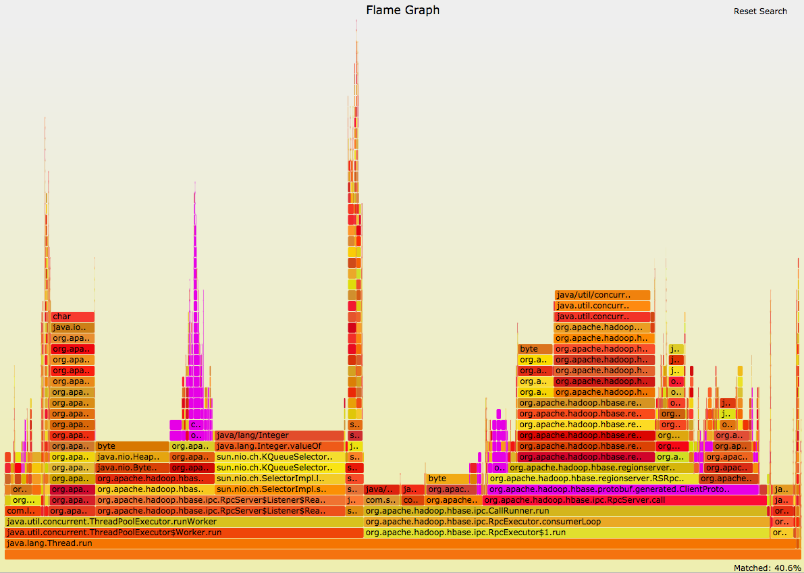
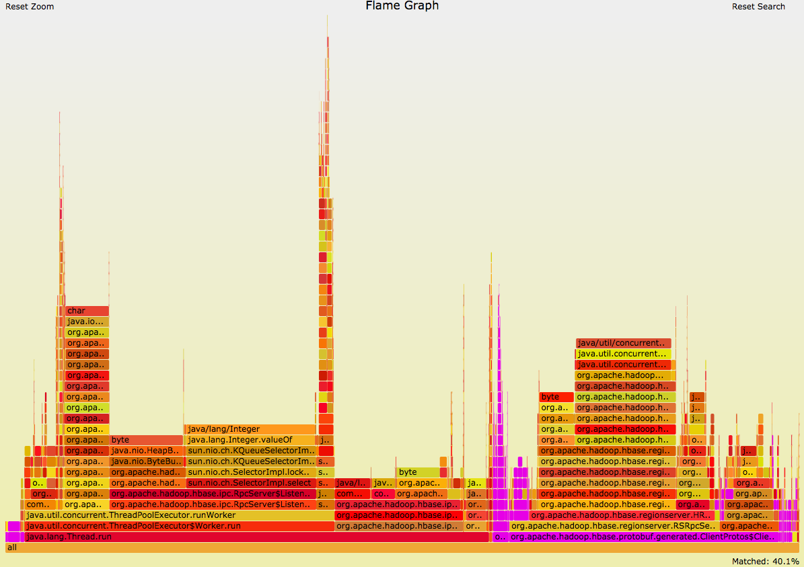

The memory allocation sampler uses a java agent based largely on the [Allocation Instrumentor](https://github.com/google/allocation-instrumenter) library. It outputs memory allocation data which can then be collapsed into a form which can be processed into a flamegraph using the [FlameGraph](https://github.com/brendangregg/FlameGraph) tools.

## Basic usage

When starting the JVM to be instrumented the location of the java agent and the properties file must be provided using the following VM argument.

```
$ java -javaagent:/tmp/java-allocation-instrumenter-3.0-SNAPSHOT.jar=/tmp/flame.properties
```

The sampler will generate an output file (by default stacks.txt) which needs to be processed by the FlameCollapse tool (provided in this project) to convert it to the format needed by the FlameGraph tools.

```
$ java -jar target/java-allocation-instrumenter-3.0-SNAPSHOT.jar stacks.txt
```

Then finally run the FlameGraph tool on the previous output (by default collapsed.txt) to generate the flamegraph itself.

```
$ FlameGraph/flamegraph.pl collapsed.txt > flamegraph.svg
```

## Package/Class Level Grouping And Filtering

Often there are multiple code paths into a particular package or class and due to the fact that flamegraphs start at the bottom of the stack trace this will cause a particular packages memory allocation to spread all across the flamegraph. You can search the flamegraph with regex's (ctrl-f) and it will highlight the search for you but often this isn't enough.



To remedy this problem the FlameCollapse tool can consolidate all samples that lead to a specific package or class and filter out the rest. To use this simply provide the second parameter (it is NOT case sensitive).

```
$ java -jar target/java-allocation-instrumenter-3.0-SNAPSHOT.jar stacks.txt protobuf
```

This filters out all stack frames prior to entering the specified package or class and all samples that do not pass through the filter. The filtered output can then be used to generate a flamegraph containing a unified summary of data from that package.



## Building

To build from source clone this repository and run

```
$ mvn clean package
```

The agent jar will be built in the `target` directory

```
$ ls -l target
total 248
drwxr-xr-x  16 jmaloney  admin    544 Aug 18 10:07 apidocs
drwxr-xr-x   4 jmaloney  admin    136 Aug 18 10:07 classes
drwxr-xr-x   3 jmaloney  admin    102 Aug 18 10:07 generated-sources
drwxr-xr-x   4 jmaloney  admin    136 Aug 18 10:07 jarjar
-rw-r--r--   1 jmaloney  admin  74471 Aug 18 10:07 java-allocation-instrumenter-3.0-SNAPSHOT-javadoc.jar
-rw-r--r--   1 jmaloney  admin  34017 Aug 18 10:07 java-allocation-instrumenter-3.0-SNAPSHOT-sources.jar
-rw-r--r--   1 jmaloney  admin   9327 Aug 18 10:07 java-allocation-instrumenter-3.0-SNAPSHOT.jar
drwxr-xr-x   4 jmaloney  admin    136 Aug 18 10:07 javadoc-bundle-options
drwxr-xr-x   3 jmaloney  admin    102 Aug 18 10:07 maven-archiver
drwxr-xr-x   3 jmaloney  admin    102 Aug 18 10:07 maven-status
drwxr-xr-x   3 jmaloney  admin    102 Aug 18 10:07 original-classes
```

The `java-allocation-instrumenter-3.0-SNAPSHOT.jar` file is the jar to specify in the javaagent parameter and the jar that contains the FlameCollapse utility.

## Sampling Strategies

There are two sampling strategies that can be employed. The way they operate is fundamentally different.

### Allocation Count Strategy

The allocation count strategy keeps a thread local counter of the number of allocations since the last sample and when that count is reached another sample is taken and the thread local counter set back to 0.

### Time Based Strategy

The time based strategy sets a global timestamp which represents the earliest time the next sample can be taken. When an allocation occurs after this timestamp the global timestamp is set to the current time plus the minSampleInterval.

### Jitter

To avoid sampling biases based on the periodic nature of programs every time a sample is taken the next time a sample can be taken has some randomness applied to it. In the case of the allocation count strategy this means that the number of allocations before the next sample is the 

`sample.rate + a random value between -sample.rate/2 and sample.rate/2`

When using the time based strategy the next time a sample can be taken is 

`System.currentTimeMillis() + min.sample.interval + a random value between -min.sample.interval/2 and min.sample.interval/2`

The average number of samples per second should still be the value set in the properties, however, there is some variance.

## Properties

The sampler itself has the following properties that can be passed into the agent.

Property Name | Values | Description
--- | --- | ---
recorder | flame/lifetime | Use either the flame of lifetime recorder
output.file | filepath | Where to output the sampling data.
stack.trace.verbosity | methodName/methodClassName/ methodClassLineNumber | How much detail about each stack frame in the sample is printed.
record.size | true/false | Whether or not to estimate size of objects.
sample.delay.secs | integer | Some applications have a long startup which you do not want to profile. This allows you delay all sampling for a specified amount of time.
sample.strategy | time/allocationCount |  The time based sampling strategy allows you to specify the minimum interval in between samples. The allocationCount strategy allows you to specify the number of allocations before taking the next sample (a count is kept per thread).
 sample.interval.ms | integer | The minimum time between samples. Only used when sample.strategy=time.
 sample.rate | integer | The number of allocations to wait before sampling. Only used when sample.strategy=allocationCount.
 
## Caveats
 
This likely breaks all escape analysis done by the JVM and thus can/will report object allocation that would otherwise be optimized away. I have a few ideas on how to generate a profile of allocations that can be eliminated through escape analysis and then use this profile to prevent instrumentation of those allocations by the sampler but that is a work in progress at best.# allocation-instrumenter-tool
